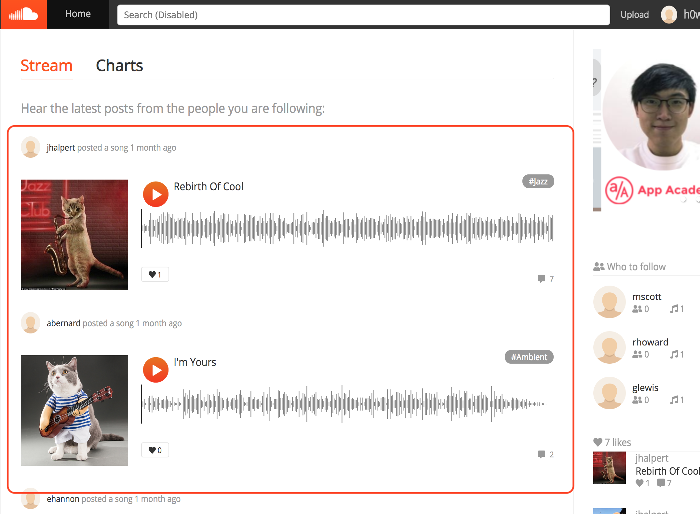
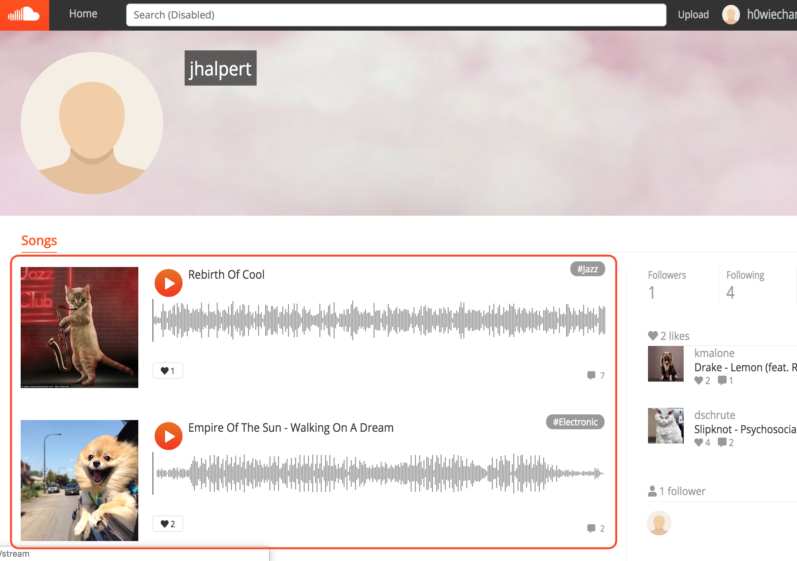
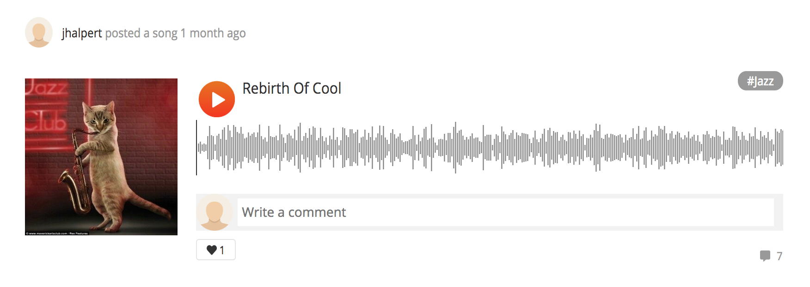

# Welcome to AcousticNimbus

AcousticNimbus is a SoundCloud-inspired web application that allows users to share, listen to music and follow their favorite artists.
[Visit AcousticNimbus Here!](http://acoustic-nimbus.herokuapp.com)

## The Front-End

On the front-end, React.js is implemented along with Redux.js to provide users an efficient and seamless experience throughout the site by updating and rendering the relevant components on the page only, while limiting expensive data retrieval from the back-end by storing data fetched at the Redux store. 

```js
// store.js

const configureStore = (preloadedState = {}) => {
  return (
    createStore(rootReducer, preloadedState, applyMiddleware(thunk, logger))
  );
};
```

```js
// root_reducer.js

const rootReducer = combineReducers({
  entities: entitiesReducer,
  session: sessionReducer,
  errors: errorsReducer,
  ui: uiReducer,
});
```

```
Redux Store Structure

- root
| - entities
  | - songs
  | - likes
  | - follows
  | - comments
  | - users
| - session
| - errors
  | - session
  | - songs
| - ui
  | - modal
  | - currentSong
  | - player
  | - queue
  | - queueList
  | - charts
```

### Categorized State
All data fetched from the database are stored under the entities reducer. Each data type is categorized into different groups for different components on different pages.
```
| - songs
  | - introSongs (splash page)
  | - likedSongs (homepage)
  | - followedSongs (homepage - stream page)
  | - rankedSongs (homepage - charts page)
  | - songsOfSpecificUser (user show page)
  | - individualSong (song show page)
  | - relatedSongsByGenre (song show page)
| - likes
| - follows
| - comments
  | - commentsOfSpecificSong
| - users
  | - randomThree (homepage)
```

### Reusable Component

Since many components on different pages share some similarities in design and structure, common components are deconstructed in a way that they could be reusable in different circumstances and grouped together in the same directory. For example:

#### Songs List - Homepage (Stream)

#### Songs List - User show page


## The Back-End

With a Ruby on Rails back-end that communicates with a PostgreSQL database and utilizes assets hosted on Amazon Web Services S3, Acoustic Nimbus optimizes data fetching by querying relevant data for different components with parameters from the front-end, which allows the back-end to handle data parsing and minimizes load times on the front-end.

```ruby
# songs_controller.rb
def index
    if params[:number].to_i == 12 # splash page
        @intro_songs = Song.last(params[:number].to_i)
    elsif params[:current_user_id] # homepage - stream page
        if params[:fetching_followed_songs]
            followings = Follow.where(follower_id: params[:current_user_id]).select(:followed_user_id)
            @followed_songs = Song.where(artist_id: followings)
        elsif params[:fetching_liked_songs]
            likes = Like.where(liker_id: params[:current_user_id]).select(:likeable_id)
            @liked_songs = Song.where(id: likes).select('*')
            @likes = Like.where(liker_id: params[:current_user_id]).select(:id)
        end
    elsif params[:order] && params[:genre] # homepage - charts page
        if params[:order] == 'newest' && params[:genre] == 'all'
            @songs = Song.last(params[:number].to_i)
        lsif params[:order] == 'newest' && params[:genre] != 'all'
            @songs = Song.where(genre: params[:genre]).last(params[:number].to_i)      
        end
    elsif params[:user_id] # user show page
        @songs_of_specific_user = Song.where(artist_id: params[:user_id]).select('*')
    elsif params[:genre]
        @related_songs_by_genre = Song.where(genre: params[:genre])
                                      .where.not(id: params[:song_id])
                                      .select('*').first(3)
    end
    render :index
end

def show
    @song = Song.find(params[:id])
    liker_ids = Like.where(likeable_id: params[:id]).select(:liker_id)
    @likers_of_song = User.where(id: liker_ids).select('*');
    @comments_of_song = Comment.where(song_id: params[:id]).select('*')
    render :show
end
```

## Features

### Waveform Audio Player
Songs on the pages are all displayed as music players with audio waveform visualization generated by Wavesurfer.js, where users can interact with the waveforms to play the music at desired time positions in the song.

```js
// waveform.js

initializeWaveform() {
    switch (this.props.klass) {
      case "banner-player":
        this.waveform = WaveSurfer.create({
          container: "#waveform",
          waveColor: "hsla (200, 100%, 30%, 0.5)",
          progressColor: "#FF5400",
          height: 150,
          barWidth: 1,
          normalize: true,
          interact: true,
          responsive: true,
          fillParent: true,
        });
        break;
      case "item-player":
        this.waveform = WaveSurfer.create({
          container: `#waveform${this.props.songId}`,
          waveColor: "grey",
          progressColor: "#FF5400",
          height: 60,
          barWidth: 1,
          normalize: true,
          interact: true,
          responsive: true,
          fillParent: true,
        });
        break;
    }
}
```

### Cross-page Audio Player
A simple, cross-page audio player is implemented at the very top level of the app, allowing users to enjoy their music without interruption while navigating around the site. While Redux store is used to keep track of the current song being played at the
moment, React.js takes care of rendering the player component by "reacting" to data changes with current song at the Redux store.

```js
// current_song_reducer.js
const defaultState = {
  song: null,
  playing: null,
  elapsed: null,
  muted: false,
};

const currentSongReducer = (state = defaultState, action) => {
  Object.freeze(state);
  let newState;
  switch (action.type) {
    case SET_CURRENT_SONG:
      newState = {
        song: action.song,
        playing: false,
        elapsed: 0,
      }
      return merge({}, state, newState);
    case PAUSE_SONG:
      newState = {
        playing: false,
      }
      return merge({}, state, newState);
    case PLAY_SONG:
      newState = {
        playing: true,
      }
      return merge({}, state, newState);
    case SET_ELAPSED_TO:
      newState = {
        elapsed: action.time,
      }
      return merge({}, state, newState);
    case MUTE_SONG:
      newState = {
        muted: true,
      }
      return merge({}, state, newState);
    case UNMUTE_SONG:
      newState = {
        muted: false,
      }
      return merge({}, state, newState);
    default:
      return state;
  }
};
```

### Auto-queueing, Shuffling & Looping
After a song is selected to be played, a queue of songs is automatically generated by the group of songs that the playing song is selected from. Songs in the queue will be played one by one in the background as the user is browsing around the site. When a song that does not exist in the current queue is selected to be played, a new queue of songs will then be dynamically generated from the new group of songs. Users can repeatedly play a single song from the queue or play all songs by looping through the entire queue in normal/shuffled order.

```js
// queue_reducer.js

const queueReducer = (state = null, action) => {
    Object.freeze(state);
    let newState;
    let unshuffledIdx;
    let shuffledIdx;
    switch (action.type) {
        case CREATE_QUEUE:
        case REPLACE_QUEUE:
            newState = {
                unshuffled: action.queue, 
                shuffled: randomize(action.queue.slice()),
            }
            return newState;
        case SHUFFLE_QUEUE:
            newState = {
                unshuffled: state.unshuffled, 
                shuffled: randomize(state.shuffled.slice()),
            }
            return newState;
        case ADD_SONG_TO_QUEUE:
            newState = {
                unshuffled: state.unshuffled.slice().push(action.song), 
                shuffled: randomize(state.unshuffled.slice().push(action.song)),
            }
            return newState
        case REMOVE_SONG_FROM_QUEUE:
            unshuffledIdx = state.unshuffled.map(song => song.id).indexOf(action.song.id);
            shuffledIdx = state.shuffled.map(song => song.id).indexOf(action.song.id);
            newState = {
                unshuffled: unshuffledIdx > 0 ? state.unshuffled.slice(0, unshuffledIdx).concat(state.unshuffled.slice(unshuffledIdx + 1)) : state.unshuffled.slice(0),
                shuffled: shuffledIdx > 0 ? state.shuffled.slice(0, shuffledIdx).concat(state.shuffled.slice(shuffledIdx + 1)) : state.shuffled.slice(0),
            }
            return newState;
        case ADD_TO_PLAY_NEXT:
            unshuffledIdx = state.unshuffled.slice().map(song => song.id).indexOf(action.data.song.id);
            shuffledIdx = state.shuffled.slice().map(song => song.id).indexOf(action.data.song.id);
            const unshuffledSongs = state.unshuffled.slice(0, unshuffledIdx).concat(state.unshuffled.slice(unshuffledIdx + 1))
            const shuffledSongs = state.shuffled.slice(0, shuffledIdx).concat(state.shuffled.slice(shuffledIdx + 1))
            const unshuffledCurrentSongPos = unshuffledSongs.map(song => song.id).indexOf(action.data.currentSong.song.id);
            const shuffledCurrentSongPos = shuffledSongs.map(song => song.id).indexOf(action.data.currentSong.song.id);
            newState = {
                unshuffled: unshuffledCurrentSongPos > 0 ? unshuffledSongs.slice(0, unshuffledCurrentSongPos).concat([action.data.song]).concat(unshuffledSongs.slice(unshuffledCurrentSongPos)) : unshuffledSongs.concat([action.data.song]),
                shuffled: shuffledCurrentSongPos > 0 ? shuffledSongs.slice(0, shuffledCurrentSongPos).concat([action.data.song]).concat(shuffledSongs.slice(shuffledCurrentSongPos)) : shuffledSongs.concat([action.data.song]),
            };
            return newState;
        default:
            return state;
    }
}
```

### Likes, Comments & Follows
Users can like, comment on any songs and follow any artist on AcousticNimbus. While users can visit the designated show page of each user(artist)/song to perform any "social interactions" - liking, commenting on a song, or following a user, stream pages provides freedom to users to like or comment on any song is currently being played without redirecting to the song's show page.



## Future Plans

In the future, I would like to implement the playlist feature for AcousticNimbus, which would let people share music in form of playlists/albums. Also, I have plans to enable playback counting for each song and allow users to rank songs by their popularity on charts page.

[Visit AcousticNimbus Here!](http://acoustic-nimbus.herokuapp.com)
